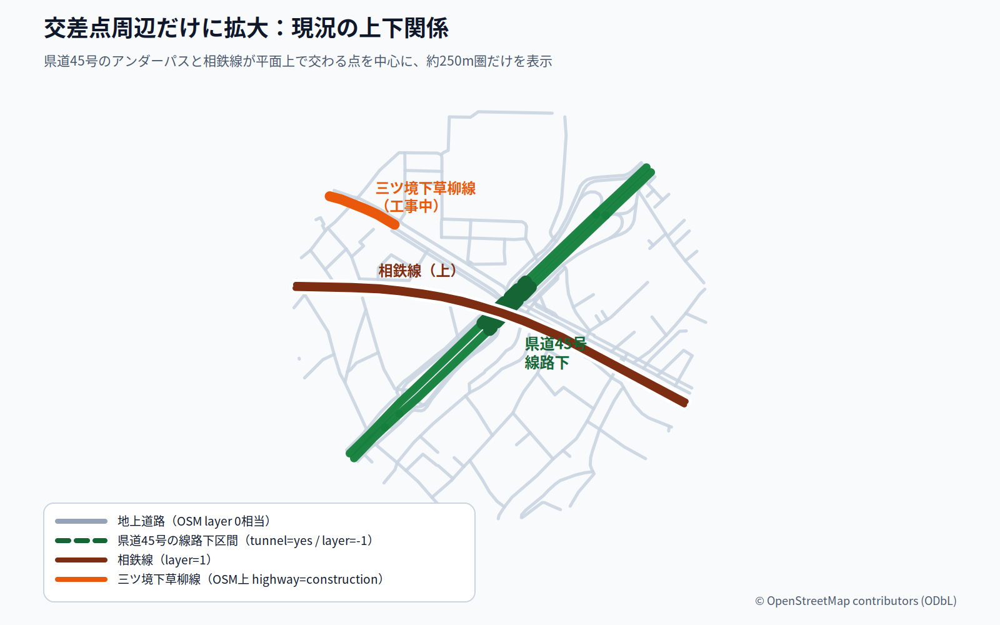
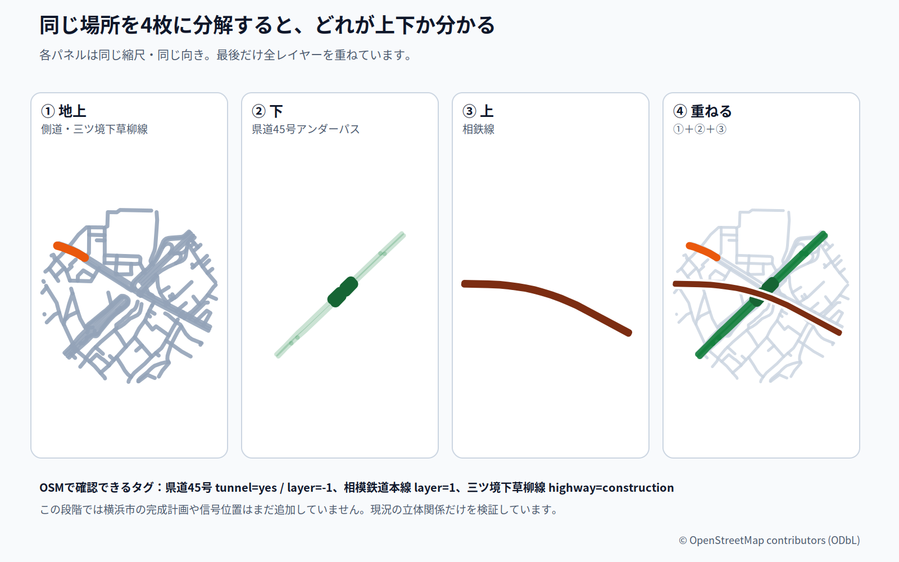
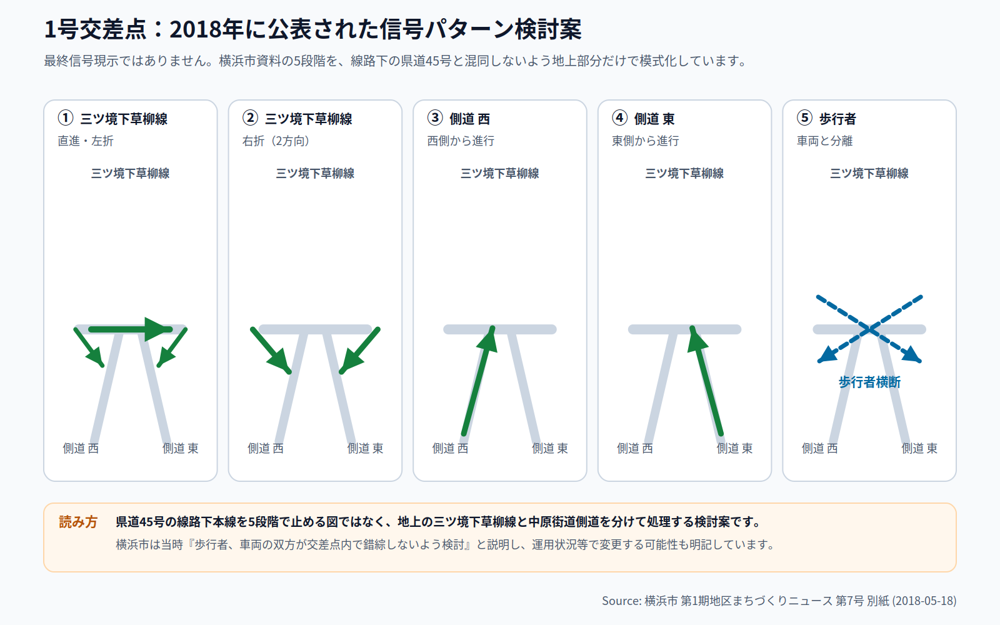

# futatsubashi-intersection-visualizer

横浜市瀬谷区・二ツ橋周辺の1号交差点について、**道路技術者が現況調査から設計図を読む順序をなぞり、立体交差と完成後の交通動線を根拠付きで復元する**ための検証リポジトリです。

## 現在の調査方針

これまでの検討で、OpenStreetMapから県道45号アンダーパス・相鉄線・地上道路の上下関係を把握できました。一方、横浜市の「完成イメージ」を地図へ目視で対応付けて描いた段階では、平面形状の対応に未検証部分が残ることも分かりました。

そのため、完成予想図を先に作る方法を中止し、次の手順へ切り替えています。

1. 横浜市道路台帳 / Rマッピー等で現況基図を確定する
2. 地上・アンダーパス・鉄道を高さ別に分離する
3. 各道路・側道へ安定したIDを付ける
4. 最新の事業計画図を現況基図へ位置合わせする
5. 計画道路・交通島・横断歩道等を根拠付きでトレースする
6. 流入方向ごとに車両動線を検証する
7. 最後に信号制御を重ねる

詳細は [docs/investigation-plan.md](docs/investigation-plan.md) を参照してください。

## 参照資料

今回の工事・道路構造の検討に使用する一次資料、道路台帳・都市計画地図、過去24号のまちづくりニュース、工事説明会資料、交通信号・道路設計の方法論資料は [sources/source-register.md](sources/source-register.md) に登録しています。

新しい公式資料を使用する場合は、先にこのsource registerへ追加します。

## 現時点で確認できている事項

### 立体構造（暫定基図による確認）

OpenStreetMapでは、該当箇所について少なくとも次のレイヤー関係が確認できます。

- 中原街道（県道45号）の該当区間: `tunnel=yes`, `layer=-1`
- 相模鉄道本線: `layer=1`
- 三ツ境下草柳線の新設区間: `highway=construction`

この確認は、県道45号の線路下本線と地上の1号交差点を同一平面として扱わないための有力な補助情報です。ただし、今後の数十mスケールの平面形状復元ではOpenStreetMapを主基図にせず、横浜市道路台帳 / Rマッピー等を優先します。

## 既存の模式図の扱い

### 2026年完成イメージ模式図

`docs/generated/06-official-2026-schematic.*` は、横浜市2026年8月工事説明会資料を読み解くために作った**未検証の模式図**です。

これは最終成果物ではありません。横浜市道路台帳と事業計画図の位置合わせを行う前に描いたため、交通島、新設道路、側道等の平面上の対応が正しいことを保証していません。今後は調査計画のGate 4を通過するまで、完成形の根拠図として使用しません。

### 2018年の信号パターン検討案

横浜市「第1期地区まちづくりニュース 第7号 別紙」に掲載された歴史的検討案を説明用に再構成しています。

1. 三ツ境下草柳線の直進・左折
2. 三ツ境下草柳線の右折（2方向）
3. 中原街道の側道 西側
4. 中原街道の側道 東側
5. 歩行者

**これは2018年時点の検討案であり、2026年の最終信号現示・灯器配置を示すものではありません。**

## 情報の分類

今後の成果物では情報を次の5種類に分けます。

- **Observed**: 現況の公式地図・公開地理データで直接確認できるもの
- **Official plan**: 横浜市等の公式資料に明記・描画された計画
- **Derived**: 位置合わせ、座標変換、単純化等で機械的に導出したもの
- **Interpretation**: 根拠と整合するが資料に直接は書かれていない解釈
- **Unknown**: 根拠不足のため確定しないもの

`Unknown` を推測で埋めないことを優先します。

## 公開データの扱い

このリポジトリは public を前提にしています。

- Google Mapsのスクリーンショットやそのトレースをコミットしません。
- ユーザー提供画像、個人情報、認証情報を公開しません。
- 横浜市PDFや国土地理院資料のページ画像を恒久的に再掲しません。
- 利用条件を確認した上で、リンク・メタデータ・provenance付き派生データを扱います。

詳細は [PUBLIC_DATA_POLICY.md](PUBLIC_DATA_POLICY.md) を参照してください。

## 再生成

GitHub ActionsでSVG/PNGを決定論的に生成し、SVG構造・文字サイズ・必須成果物を検査します。今後はさらに、計画道路の各レイヤーにsource/provenance IDを持たせ、異なる高さの道路を誤って交差点化していないことや、動線が同一平面の接続道路上を連続していることも検証対象にします。
